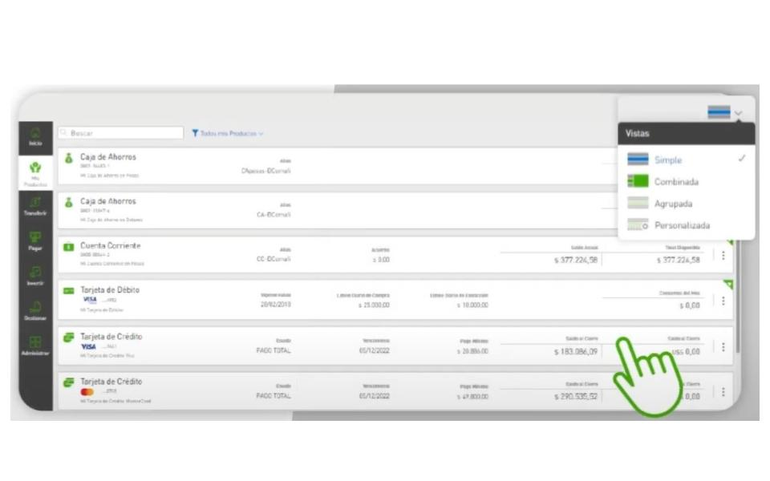
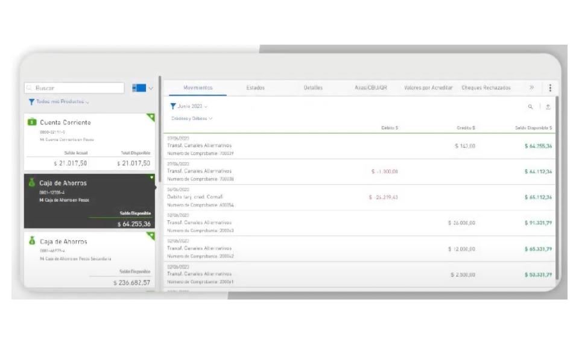
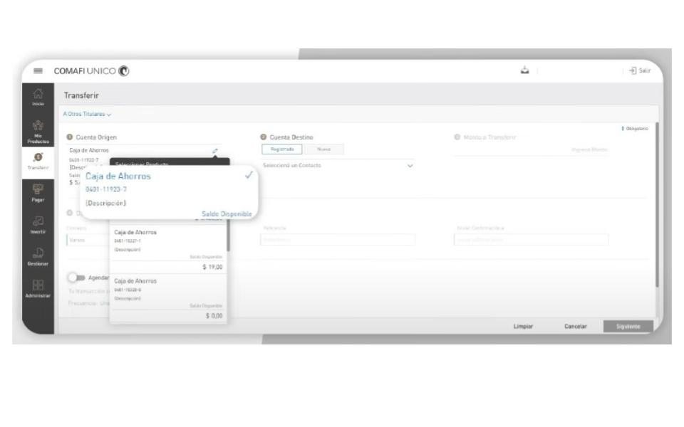
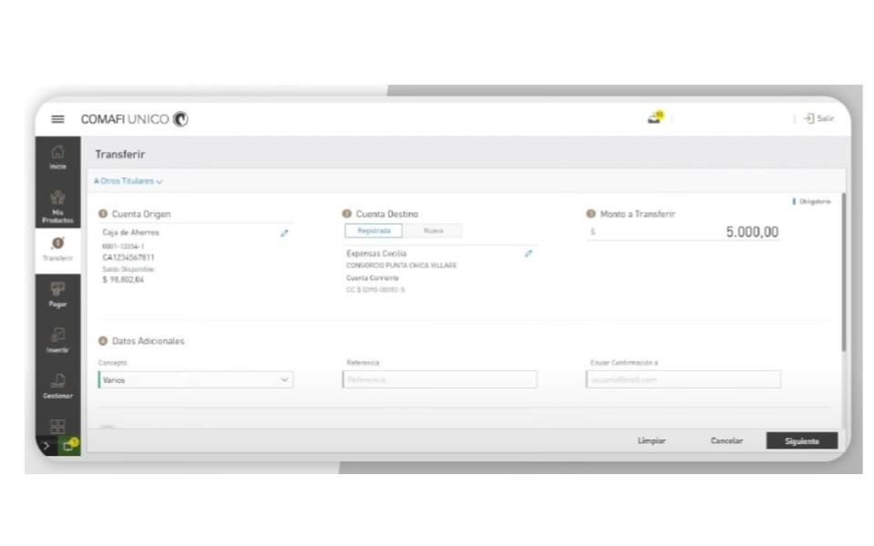
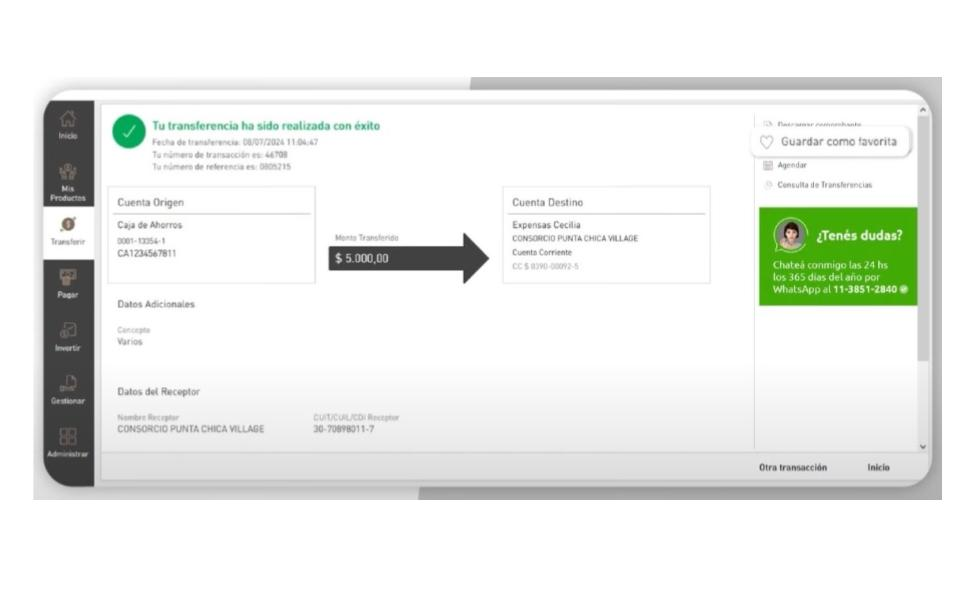

# Tester - QA Manual

#### Technical Skills: Postman, SQL, Azure, Soucelabs, Backend testing, Jira

## Educación
- Analista de Sistemas |Ifts 11| (_Agosto 2020 - En curso_)
- Analista de Rrhh |IUTIRLA| (_Agosto 1996 - Junio 2001_)							       		
- Diplomado:Testing-QA |UNTREF| (_Mar 2024 - En curso_)
- Diplomado: Docencia |AVEPANE Ccs| (_Abril 2015_) 			        		

## Experiencia Laboral
**Tester Ssr. @ Infocorp Uruguay (_December 2022 - Mayo 2024_)**
1. Verificación de Funcionalidad y Servicios:
- Probar las características principales del software bancario, como apertura de cuentas, transferencias y pagos.
- Comprobar la integración de servicios adicionales, como emisión de tarjetas de crédito y gestión de préstamos.

2. Pruebas de Interfaz de Usuario:
- Realizar pruebas de interfaz de usuario para garantizar la navegación intuitiva y el cumplimiento de las pautas de diseño.
- Verificar la autenticación y autorización para asegurar el acceso solo a usuarios autorizados.

3. Documentación y Reporte de Resultados:
- Documentar procedimientos de prueba, resultados y defectos encontrados.
- Generar informes detallados para comunicar hallazgos al cliente y al equipo de desarrollo, asegurando la resolución oportuna de problemas.

4. Colaboración para la Mejora Continua:
- Colaborar con el equipo de desarrollo y otros interesados para implementar correcciones y mejoras basadas en los resultados de las pruebas.

**Tester QA @ Qualis Lab Argentina (_Marzo 2022 - Diciembre 2022_)**
1. Análisis y Documentación de Requerimientos:
- Análisis de requerimientos.
- Generación de documentación.
- Definición de criterios de aceptación.
- Redacción de historias de usuario.

2. Diseño y Ejecución de Pruebas:
- Diseñar, ejecutar y mantener casos de prueba.
- Realizar testing manual en frontend y APIs.
- Testing de aplicaciones web y móviles.
- Ejecución de pruebas funcionales y no funcionales, incluyendo pruebas de backend (microservicios y consultas a la BBDD).

3. Gestión de Defectos:
- Elaboración de reportes de bugs.
- Seguimiento a la resolución de bugs durante todo el ciclo de vida del proyecto.

4. Comunicación y Colaboración:
- Participar en reuniones diarias del equipo.
- Comunicar el avance de las pruebas.
- Escalar riesgos y situaciones relacionadas al proyecto.

**Tester Jr. @ TCS Argentina (_Octubre 2021 - Marzo 2022_)**
1. Análisis y Preparación de Pruebas:
- Analizar y entender las historias de usuario y criterios de aceptación.
- Participar en las ceremonias de Scrum para informar y dar seguimiento sobre las tareas asignadas.

2. Diseño y Ejecución de Casos de Prueba:
- Diseño y ejecución de casos de prueba usando la herramienta ALM.

3. Ejecución de Pruebas No Funcionales:
- Realizar pruebas no funcionales, incluyendo la prueba de microservicios con Postman.

## Proyectos:
### HBI Individuos - Banco Comafi ( Argentina)
[UI Comafi HBI Individuos](https://www.comafi.com.ar/atencion-cliente-individuos/tutoriales.aspx)

Participación en el Proyecto Online Banking de Banco Comafi

Como miembro del equipo de Testing, tuve la oportunidad de contribuir al desarrollo del Proyecto Online Banking para Banco Comafi. En este proyecto, trabajamos en la creación y lanzamiento de una plataforma de banca en línea moderna y responsiva, diseñada para ofrecer una experiencia de usuario intuitiva y segura. Esta plataforma permite a los clientes gestionar sus finanzas de manera flexible desde cualquier dispositivo, en cualquier momento, gracias a su disponibilidad 24/7. La herramienta también incorpora funcionalidades avanzadas para mejorar el servicio al cliente y mantenernos competitivos en el mercado.

## Pruebas Web Realizadas:

En el marco de este proyecto, realizamos pruebas funcionales exhaustivas en varias interfaces clave de la plataforma. Entre las funcionalidades evaluadas se incluyen:

Creación de usuarios.
Acceso y gestión de “Mis Productos”.
Transferencias.
Pago de Servicios.
Pago de Préstamos.
Altas de Prodcutos.

Estas pruebas garantizaron el correcto funcionamiento de las características críticas del sistema y ayudaron a optimizar la experiencia del usuario. 

### Creación de usuarios :

### Vista de Mis Productos :

### Transferencias entre cuentas :

### APP Comafi
Pruebas Manuales en la App Móvil Comafi

En el proceso de desarrollo de la nueva aplicación móvil de Banco Comafi, se llevaron a cabo exhaustivas pruebas manuales para asegurar su funcionamiento óptimo y la mejor experiencia para el usuario. Las pruebas se centraron en validar las siguientes funcionalidades clave:

- Visualización de Productos: Se verificó la correcta visualización y actualización de la información relacionada con todas las cuentas y tarjetas del usuario.
- Transferencias a Contactos: Se realizaron pruebas para garantizar que las transferencias de dinero a contactos guardados se procesaran de manera eficiente y sin errores.
- Pagos de Tarjetas: Se comprobó el funcionamiento de los pagos para las tarjetas Comafi y otras tarjetas de crédito, asegurando que las transacciones se completaran correctamente.
- Pagos de Impuestos y Servicios: Se testearon los pagos de impuestos y servicios para confirmar que estos se realizaran de forma precisa y sin inconvenientes.
- Recargas de Crédito: Se validó el proceso de recarga de crédito en el móvil y otros servicios relacionados para asegurar su correcta ejecución.

Estas pruebas manuales fueron fundamentales para identificar y corregir posibles fallos, garantizando una aplicación móvil robusta, intuitiva y segura para todos los usuarios.
[Página Comafi HBI Individuos App](https://www.comafi.com.ar/atencion-cliente-individuos/tutoriales.aspx)

### APP Comafi UI: 
A continuación una muestra de las pruebas que fueron realziadas a la nueva App de Comafi, las mismas fueron realizadas tanto para Android como iOS:

### Activación de Soft Token:

### Transferencias entre cuentas:

## Ted Talks & Lecturas:
- Fracaso ¿Celebrarlo o no celebrarlo? :   [Ted Talk link ](https://youtu.be/fa4BtTAlqZk?si=EKwUHvz9BeIz9Jv6)
- ¿Qué hace único a un gran comunicador? : [Ted Talk link ](https://youtu.be/diz6S0LEvfA?si=69CG5Ovh7oRzx5Ms)
- Sin pensamiento critico no eres nadie :  [Ted Talk link ](https://youtu.be/WxC4RfTiOsM?si=BL1xBf9XOFLFRyfk)
- 7 Ways to Make a Conversation With Anyone : [Ted Talk link ](https://youtu.be/F4Zu5ZZAG7I?si=A7rqoD4BOV4DVgCS)
- How to stop screwing yourself over : [Ted Talk link ](https://youtu.be/Lp7E973zozc?si=BZNSrvieepsxLFpa)

## Tutoriales:
Este es mi canal de Youtube: [JeanCa En Remoto YouTube](https://www.youtube.com/feed/playlists)

## Publicaciones:
Este es mi Blog: [JeanCa En Remoto Blog](https://jeancaenremoto.wordpress.com/)

